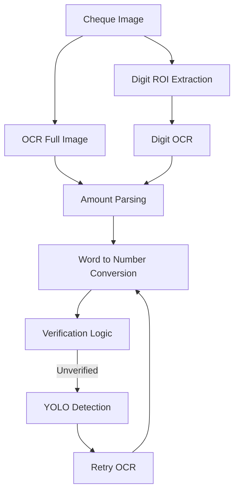

# **Fincheck — Confidence-Aware Cheque Digit Validation System**
[](https://mukesh1352.github.io/fincheck-next/)
[](https://github.com/mukesh1352/fincheck-next)


**Risk-Aware Handwritten Digit Verification for Financial Documents**

**Frontend:** Next.js (Bun)
**Backend:** FastAPI + PyTorch + OpenCV
**Storage & Reports:** MongoDB + ReportLab

---

## Abstract

Traditional OCR and digit-recognition systems optimize for accuracy and always emit a prediction. In financial workflows such as cheque processing, **a wrong prediction is more dangerous than no prediction**.

**Fincheck** reframes handwritten digit recognition as a **risk evaluation problem** rather than an accuracy problem. The system:

* Quantifies prediction confidence and uncertainty
* Computes FAR/FRR and a risk score
* Rejects ambiguous inputs instead of guessing
* Enables human-in-the-loop verification
* Provides auditability via PDF reports and database logging

Fincheck is **not an OCR engine**. It is a **confidence-aware digit validity filter** for financial systems.

In addition, Fincheck evaluates model robustness under distribution shift by
benchmarking the same compressed architectures on the CIFAR dataset.
This enables comparison between **in-distribution safety (MNIST)** and
**out-of-distribution generalization (CIFAR)**, revealing which compression
methods degrade gracefully under real-world visual complexity.


---

## Core Principle

> **If the system is not confident, it must refuse.**  
> **A model that performs well only on MNIST but collapses under CIFAR is considered unsafe for real-world deployment.**


---

## System Architecture

### System Architecture I — Confidence-Aware Digit Validation Pipeline (MNIST Risk Filter)

```mermaid
flowchart TD
    A[User Image Upload]
    B[Preprocessing - OpenCV]
    C[Digit Segmentation]
    D[MNIST Normalization 28x28]
    E[MNIST CNN Models]
    F[Confidence Entropy Stability]
    G[FAR FRR Risk Score]
    H[VALID / AMBIGUOUS / INVALID]

    A --> B
    B --> C
    C --> D
    D --> E
    E --> F
    F --> G
    G --> H
````

**Purpose:**
Safely validate handwritten digits by rejecting low-confidence or ambiguous predictions instead of guessing.

---

### System Architecture II — MNIST vs CIFAR Compression Robustness Comparison

```mermaid
flowchart TD
    A[Dataset Input]
    B[Optional Stress Perturbations]
    C[Batch Inference]

    D1[MNIST Models]
    D2[CIFAR Models]

    E[Metrics Extraction]
    F[FAR FRR Risk Score]
    G[Generalization Comparison]

    A --> B
    B --> C
    C --> D1
    C --> D2
    D1 --> E
    D2 --> E
    E --> F
    F --> G
```

**Purpose:**
Compare compressed model safety under **in-distribution (MNIST)** and
**out-of-distribution (CIFAR)** conditions to expose robustness gaps.

---

### System Architecture III — Cheque Amount Verification (Digits + Text + YOLO Fallback)



**Purpose:**
Verify cheque amounts by cross-checking numeric and written values with a safe fallback mechanism.

----

## Why MNIST Is Used

MNIST is not used to recognize cheques.
It serves as a **digit shape manifold prior**.

Digits that do not resemble canonical handwritten digits result in:

* Low confidence
* High entropy
* Automatic rejection

MNIST acts as a **risk filter**, not an OCR system.

CIFAR is intentionally more complex and visually diverse than MNIST.
While MNIST measures digit plausibility and safety, CIFAR is used to
evaluate how compression techniques generalize under higher visual entropy.

A safe model should perform well on MNIST and degrade gracefully on CIFAR.
CIFAR results are interpreted only after MNIST acceptance, never as a standalone decision signal.

---

## Digit Segmentation Pipeline

1. Grayscale conversion
2. Stroke enhancement (morphological close)
3. Otsu thresholding and inversion
4. Connected component extraction
5. Geometric filtering (area, width, height)
6. Left-to-right ordering
7. MNIST normalization:

   * Tight crop
   * Aspect-ratio safe resize
   * 28×28 canvas
   * Center-of-mass alignment

Segmentation is treated as a **risk control stage**. Borderline components are rejected.

## Multi-Model Inference

All models are loaded at startup and evaluated in parallel:

| Model               | Technique              |
| ------------------- | ---------------------- |
| baseline_mnist.pth  | Standard CNN           |
| kd_mnist.pth        | Knowledge Distillation |
| lrf_mnist.pth       | Low Rank Factorization |
| pruned_mnist.pth    | Weight Pruning         |
| quantized_mnist.pth | Quantization           |
| ws_mnist.pth        | Weight Sharing         |

This allows model comparison using **risk metrics**, not just accuracy.


The same compression techniques are mirrored for CIFAR:

| Model               | Dataset | Purpose                    |
|--------------------|---------|----------------------------|
| baseline_cifar.pth | CIFAR   | Generalization baseline    |
| kd_cifar.pth       | CIFAR   | Distilled robustness test  |
| lrf_cifar.pth      | CIFAR   | Low-rank stress behavior   |
| pruned_cifar.pth   | CIFAR   | Sparsity degradation test  |
| quantized_cifar.pth| CIFAR   | Precision sensitivity test |
| ws_cifar.pth       | CIFAR   | Shared-weight robustness   |

MNIST and CIFAR results are never merged; they are compared to expose
robustness gaps introduced by compression.


---

## Risk Metrics

Fincheck evaluates models using:

* **Confidence** — mean max softmax probability
* **Entropy** — prediction uncertainty
* **Stability** — logit variance
* **Latency** — inference time
* **FAR** — False Accept Rate
* **FRR** — False Reject Rate

**Risk Score**

```
Risk = 0.5 × FAR + 0.5 × FRR
```

Lower risk score is preferred over higher accuracy.

---

## Stress Testing (Cheque Simulation)

Runtime perturbations simulate real cheque conditions:

| Parameter | Effect              |
| --------- | ------------------- |
| Blur      | Camera focus issues |
| Rotation  | Skewed scan         |
| Noise     | Sensor noise        |
| Erase     | Ink loss            |

Used in `/run` and `/run-dataset`.

The same perturbations are applied to CIFAR to analyze whether compression-induced failures amplify under visual complexity.

---

## API Endpoints

| Endpoint                  | Purpose                        |
| ------------------------- | ------------------------------ |
| `POST /verify-digit-only` | Image-only digit validation    |
| `POST /verify`            | OCR vs typed text validation   |
| `POST /run`               | Single image stress test       |
| `POST /run-dataset`       | Dataset benchmarking           |
| `POST /export-pdf`        | Generate PDF evaluation report |
| `GET /export/pdf/{id}`    | Rebuild report from database   |
| `GET /compare/{id}` | MNIST vs CIFAR model comparison |


---

## PDF Reporting & Logging

Each export:

* Stores experiment results in MongoDB
* Generates a PDF with:

  * Metrics table
  * Confusion matrices
  * Experiment metadata

Ensures auditability and reproducibility.

---

## Frontend as Experiment Control Panel

The UI is designed for experimentation:

* Confidence threshold slider
* Noise / perturbation sliders
* Model selection
* Dataset sampling
* Preprocessed image preview
* Model sorting by risk / latency / confidence
* Experiment presets
* MNIST vs CIFAR comparison dashboard
* Delta visualization (accuracy, latency, risk)
* Dataset-level winner identification
* Compression generalization ranking

---

## Technology Stack

### Frontend

* Next.js (App Router)
* TypeScript
* Tailwind CSS
* Bun

### Backend

* FastAPI
* PyTorch
* OpenCV
* NumPy / SciPy
* Tesseract (for `/verify`)
* MongoDB
* ReportLab

---

## Project Structure

```
fincheck/
├── fintech-backend/
│   ├── server.py
│   ├── model_def.py
│   ├── model/
│   ├── data/
│   └── requirements.txt
│
├── fintech-frontend/
│   ├── app/
│   ├── components/
│   └── package.json
```

---

## Setup Instructions

### 1. Prerequisites

Install:

* Python 3.10+
* Node.js 18+
* Bun
* MongoDB Atlas account
* Tesseract OCR

#### Install Bun

```bash
curl -fsSL https://bun.sh/install | bash
```

Verify:

```bash
bun --version
```

#### Install Tesseract

**Ubuntu**

```bash
sudo apt install tesseract-ocr
```

**Mac**

```bash
brew install tesseract
```

---

## Backend Setup (FastAPI)

```bash
cd fintech-backend

python -m venv venv
source venv/bin/activate  # Windows: venv\Scripts\activate

pip install -r requirements.txt
pip install scipy
```

Create `.env`:

```
MONGODB_URI=your_mongodb_connection_string
```

Download MNIST models into `model/`.

Run server:

```bash
uvicorn server:app --reload --port 8000
```

---

## Frontend Setup (Next.js + Bun)

```bash
cd fintech-frontend

bun install
bun run dev
```

App runs at:

```
http://localhost:3000
```

---

## Reproducibility Features

* Fixed random seeds for perturbations
* Deterministic CUDA settings
* MongoDB experiment logging
* PDF report generation
* Explicit model selection

---

## Intended Use Cases

* Cheque digit validation
* Account number verification
* Amount field verification
* Human-in-the-loop financial review systems
* ML robustness research
* Risk-aware ML demonstrations
* Compression robustness and generalization analysis

---

## Design Philosophy

Fincheck prioritizes:

* Safety over accuracy
* Rejection over risky prediction
* Explainability over opacity
* Auditability over convenience

---

## License

For academic, research, and demonstration purposes only.

---

## Contributors

| Name   | Focus                                      |
| ------ | ------------------------------------------ |
| Mukesh | UI controls, decision logic, visualization |
| Albert | Metrics, ground truth, validation          |
| Rathna | Perturbations, preprocessing, datasets     |
| Vikas  | Experiment management, exports, presets    |

---

**Fincheck is not an OCR demo.**
It is a **risk-aware digit validation framework for financial systems.**


- API Specification → [`docs/api-spec.md`](docs/api-spec.md)
- Architecture Overview → [`docs/architecture.md`](docs/architecture.md)
- Evaluation Metrics → [`docs/evaluation-metrics.md`](docs/evaluation-metrics.md)